<p align="center">
  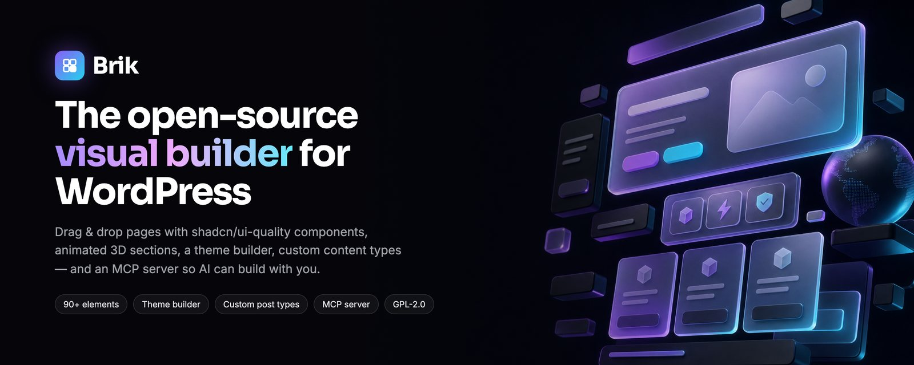
</p>

<p align="center">
  <a href="https://github.com/dilukangelosl/brik/releases/latest"></a>
  <a href="LICENSE"></a>
  
  
  
</p>

<p align="center">
  <b>Design any WordPress site visually — or let your AI assistant build it for you.</b><br>
  Drag &amp; drop builder · shadcn/ui-quality components · animated 3D sections · theme builder ·<br>
  custom post types &amp; fields · WooCommerce · built-in MCP server · 100% open source
</p>

<p align="center">
  <a href="#-quick-start">Quick start</a> ·
  <a href="#-features">Features</a> ·
  <a href="#-build-with-ai-mcp">MCP</a> ·
  <a href="docs/">Docs</a> ·
  <a href="#-development">Development</a>
</p>

<br>

<p align="center">
  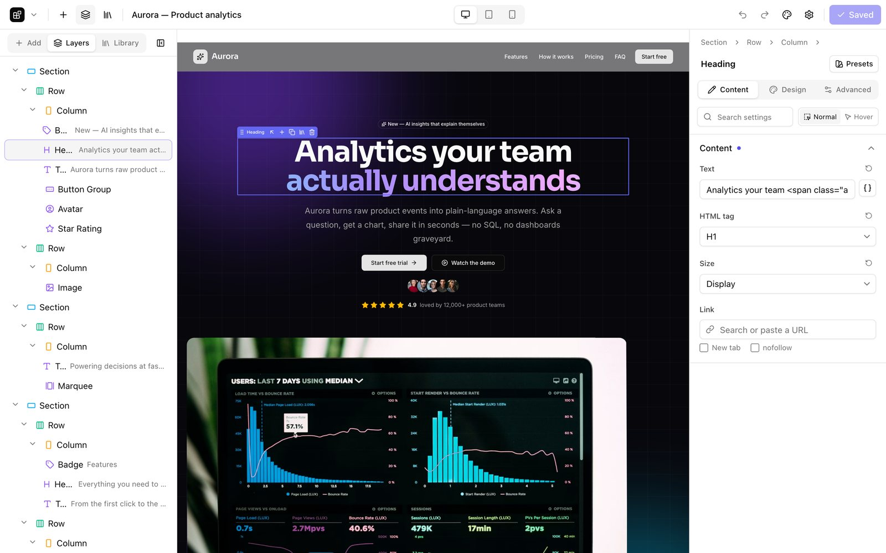
</p>

## Why Brik

Page builders are either powerful but closed, or open but dated. Brik is a modern, fully open-source
alternative to Divi and Elementor:

- **It looks great by default.** Every component follows the [shadcn/ui](https://ui.shadcn.com) design
  language and a real token-based design system (colors, radius, fonts, light &amp; dark).
- **What you see is what ships.** The canvas is your actual page, rendered by the same PHP that
  serves visitors — no separate preview engine, no shortcode soup.
- **No lock-in.** Pages are stored as JSON *and* as clean HTML in the post, so content stays readable
  even if you switch the plugin off.
- **AI-native.** A built-in [Model Context Protocol](https://modelcontextprotocol.io) server lets
  Claude, Cursor, VS Code or any MCP client create pages, headers, menus and content types for you.
- **Fast.** Server-rendered markup, tiny scoped stylesheets, and heavy effects that only load on the
  pages that use them — and pause when they're off screen.

## ✨ Features

### A visual builder that feels like a design tool

<table>
<tr>
<td width="50%">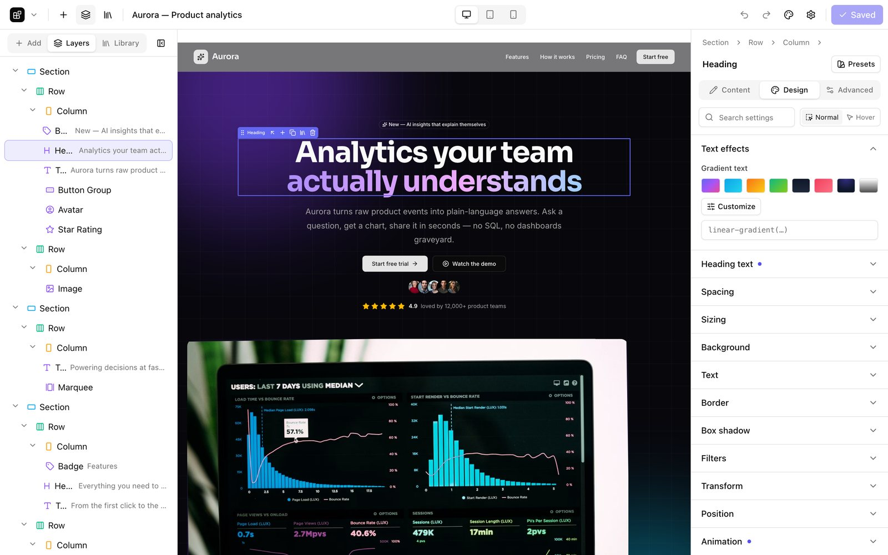</td>
<td width="50%">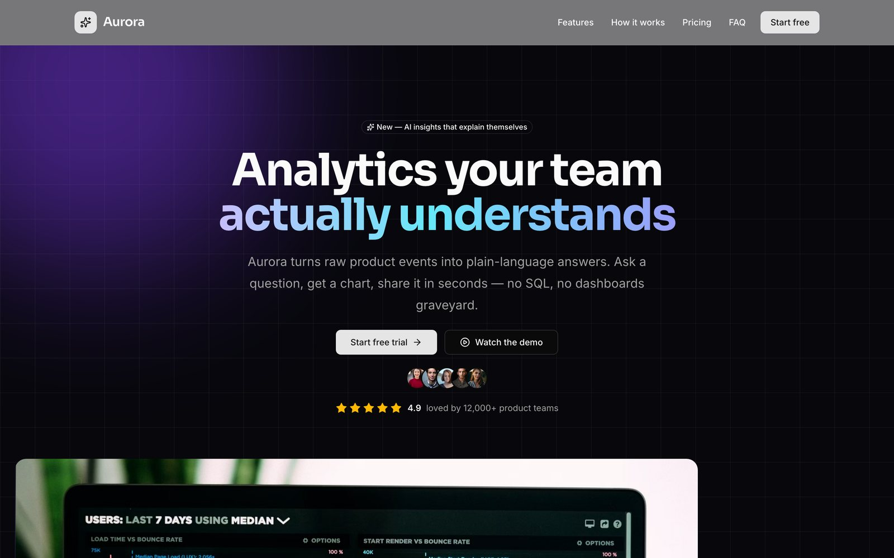</td>
</tr>
</table>

- Sections → rows → columns → elements, with drag &amp; drop from the panel, the canvas and the layers tree
- Rows with grid **or** flexbox layouts — direction, reverse, fit-content, justify and wrap per device
- Double-click any text to edit it in place; undo/redo with history; copy/paste elements and styles
- Desktop, tablet and phone editing, plus hover states for any style
- Full design controls: spacing, sizing, backgrounds (gradients, images, video, parallax), typography,
  borders, shadows, filters, transforms, position, sticky, entrance animations, custom CSS
- Global colors and fonts, style presets, global elements that sync everywhere
- Shape dividers that automatically blend with the next section, in light and dark mode
- 40 ready-made sections and a library for your own, with JSON import/export

### 90+ elements, from basics to 3D

<table>
<tr>
<td width="50%">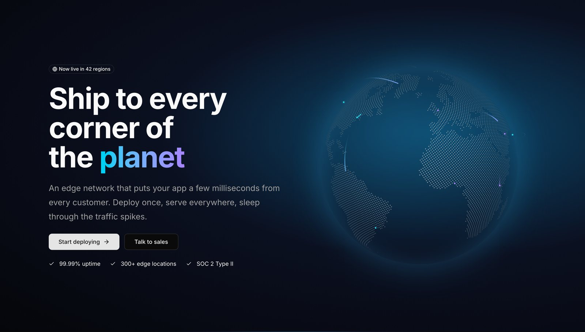</td>
<td width="50%">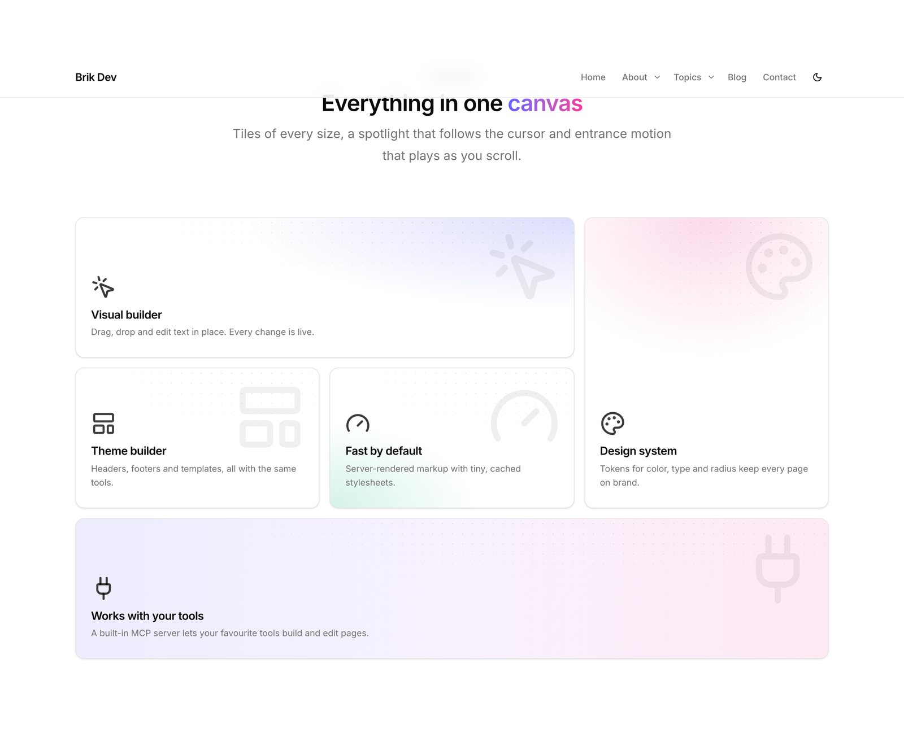</td>
</tr>
<tr>
<td width="50%">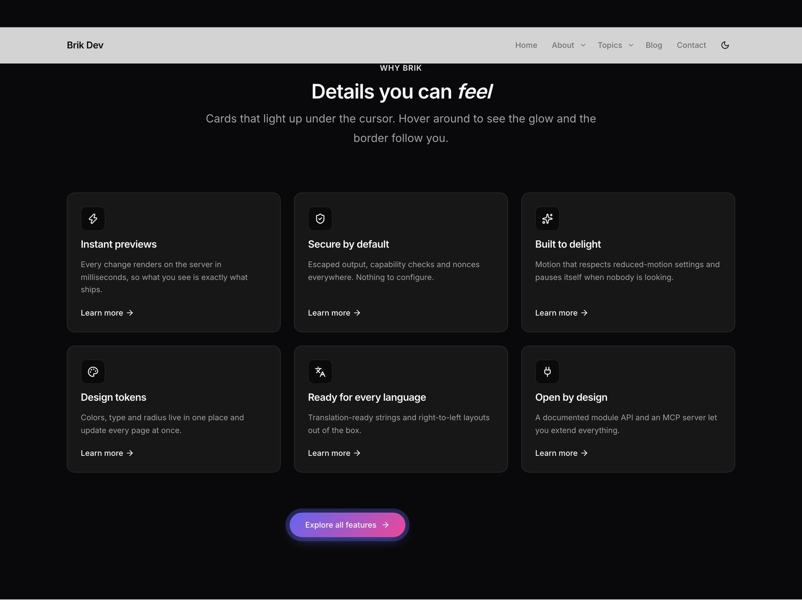</td>
<td width="50%">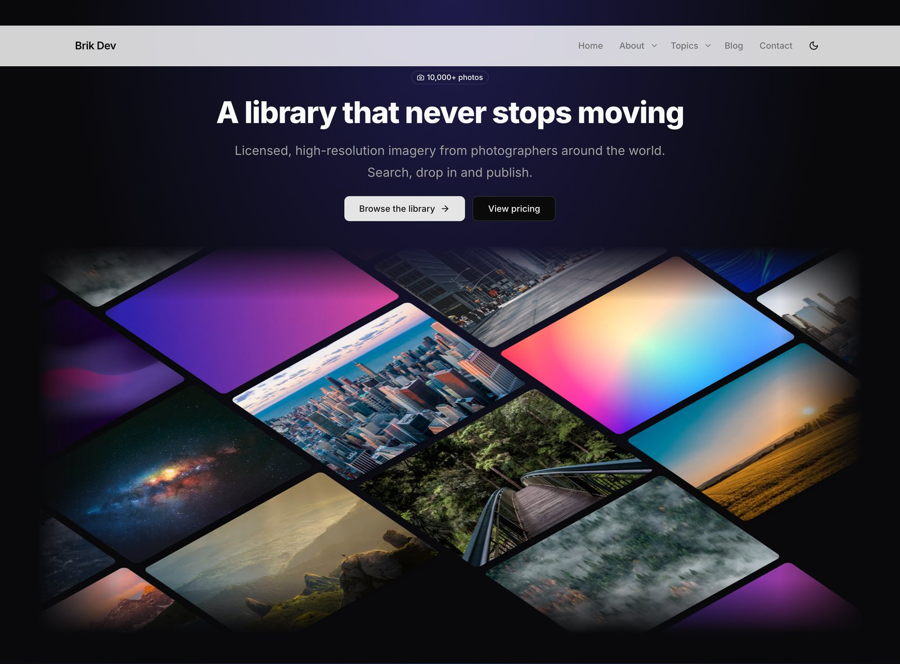</td>
</tr>
<tr>
<td width="50%">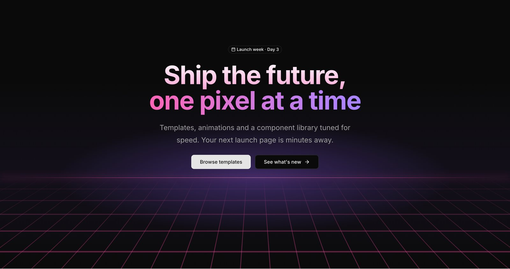</td>
<td width="50%">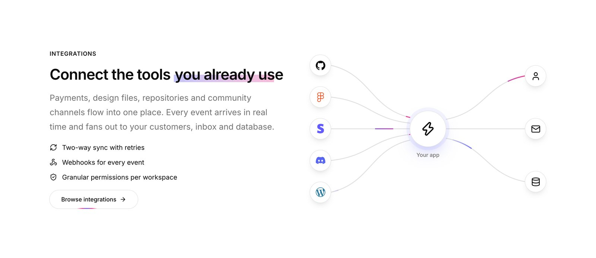</td>
</tr>
</table>

| | |
| --- | --- |
| **Basics** | heading, rich text, button, button group, badge, alert, avatar, icon, icon list, divider, spacer, star rating, code, shortcode |
| **Content** | card, blurb, CTA, pricing table, stats, counters, progress bars, testimonial, team member, timeline, table, logo cloud |
| **Media** | image, gallery + lightbox, video, audio, map, embed, before/after, marquee |
| **Interactive** | accordion, tabs, toggle, modal &amp; sheet, tooltip, hover card, carousel, countdown, theme toggle |
| **Effects** | animated headlines (typewriter, rotate, scramble, shimmer, scroll reveal…), spotlight / tilt / border-beam cards, bento grid, fancy buttons, dock, orbiting icons, integration beams, animated list, terminal, 3D icon cloud, scroll progress |
| **3D &amp; scroll** | WebGL globe, dotted world map, container-scroll device, hero parallax, sticky scrollytelling, 3D marquee, device mockups, card stack, parallax layers, video-masked text, scroll-zoom image |
| **Backgrounds** | 17 animated section backgrounds — aurora, WebGL gradient mesh, beams, meteors, stars, sparkles, particles, flickering &amp; retro grids, glowing dots, light rays, waves, vortex, spotlight, lamp, ripple, grain |
| **Forms** | contact form, newsletter signup, search, login |
| **Site &amp; posts** | menu, logo, site title, breadcrumbs, post title/content/meta/excerpt, featured image, author box, post navigation, comments, sidebar, posts grid, listings &amp; filters, custom field |

Everything is written from scratch in vanilla JS, CSS and raw WebGL — no React or three.js on the
front end — respects `prefers-reduced-motion`, and pauses off-screen.

### Navigation builder

<table>
<tr>
<td width="72%">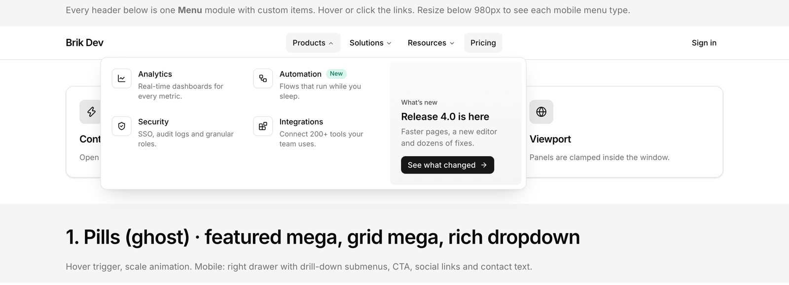</td>
<td width="28%">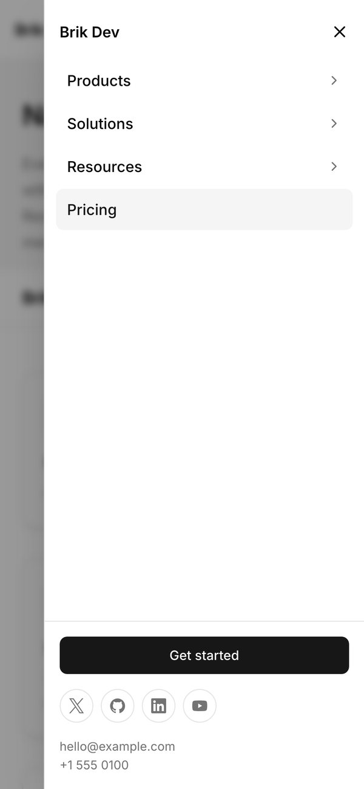</td>
</tr>
</table>

- Visual menu editor with drag, indent and outdent; items can be links, dropdowns, mega menus, buttons, headings or dividers, with icons, badges and descriptions
- Mega menus as link columns, icon grids, links + featured card, or **any layout you design in the builder**
- Desktop styles: ghost, underline, animated underline, pill container, sliding indicator; hover or click; fade, slide or scale
- Mobile: drawer, full-screen, drop-down or bottom sheet; accordion or drill-down submenus; morphing hamburger; staggered links
- Header behaviours: sticky, transparent overlay, shrink on scroll, hide on scroll down / reveal on scroll up

### Theme builder

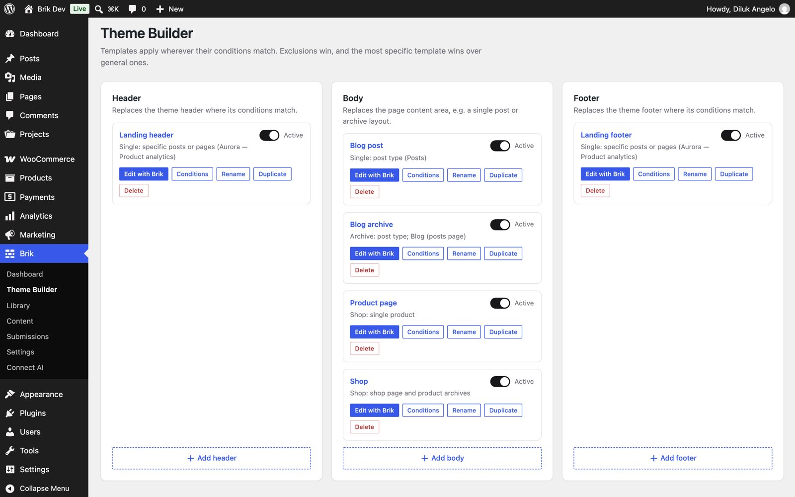

Design headers, footers and body templates with the same builder, then decide where they apply:
entire site, front page, blog, post types, specific posts, archives, taxonomy terms, authors, search,
404 — with exclusions and specificity handled for you.

### Custom post types, fields, listings and forms

<table>
<tr>
<td width="50%">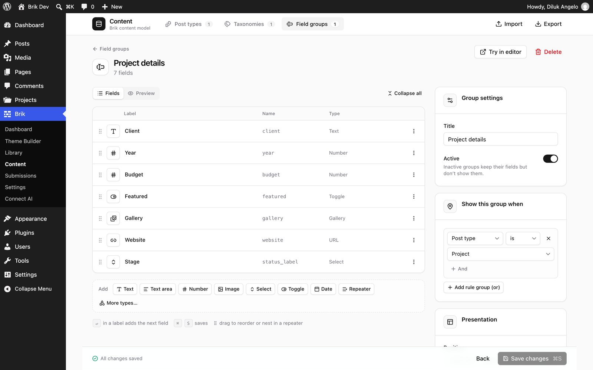</td>
<td width="50%">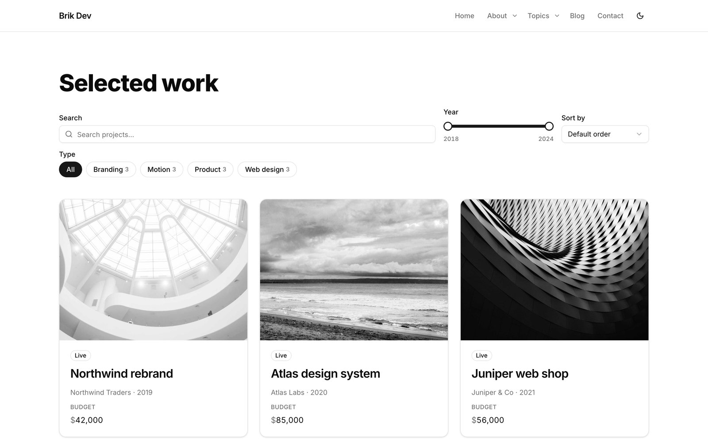</td>
</tr>
</table>

- **Brik → Content**: create post types and taxonomies with live label generation and an icon picker,
  or start from templates (portfolio, team, events, products, testimonials, FAQ, real estate, jobs)
- **25 field types** — repeaters, groups, relationships, galleries, files, maps, dates, colors,
  conditional logic and validation — in polished meta boxes for posts, terms, users and site options
- `{field:price}` dynamic tags anywhere in the builder, plus a Field element and `brik_field()` in PHP
- **Listings**: query any post type, design the loop item visually, add grids, carousels, load-more
  or infinite scroll
- **Filters**: search, term pills, checkboxes, range sliders and sorting — AJAX with shareable URLs,
  and they still work without JavaScript
- **Forms that do things**: create or update posts (with image uploads, custom fields and terms),
  register users, send email, save entries, call webhooks

### WooCommerce

<table>
<tr>
<td width="50%">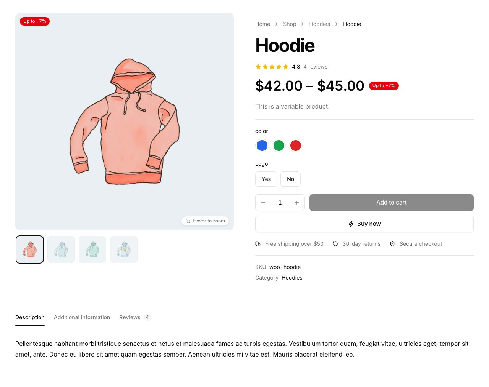</td>
<td width="50%">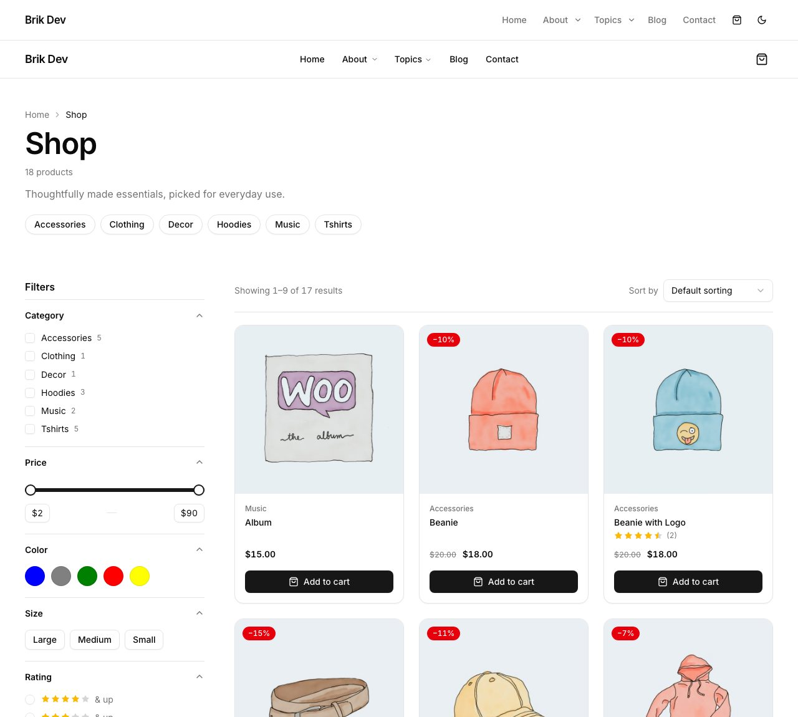</td>
</tr>
</table>

- Product page elements: gallery with zoom, lightbox and variation images; add to cart with color swatches,
  size pills, quantity stepper, AJAX add and buy now; tabs, reviews, stock, badges, related and upsells
- Product grids and carousels, quick view, category cards, result count and sorting
- Filters for price, categories, attributes (swatches and pills), rating, stock and sale — with a mobile sheet
- Header mini cart with a slide-out drawer and free-shipping progress; restyled cart, checkout, account and thank-you pages
- Theme builder conditions for products, shop, categories, cart, checkout and account, plus `{product:price}`-style tags
- Uses WooCommerce's own forms underneath, so gateways and extensions keep working

## 🤖 Build with AI (MCP)

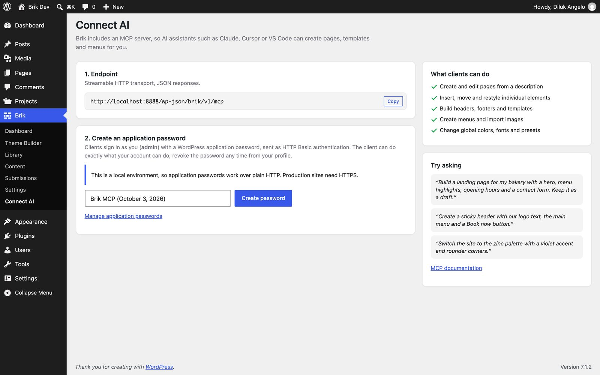

Brik exposes an MCP endpoint at `/wp-json/brik/v1/mcp` (Streamable HTTP, authenticated with a
WordPress application password). **Brik → Connect AI** creates the password and gives you ready-to-paste
config. With Claude Code:

```bash
claude mcp add --transport http brik https://your-site.com/wp-json/brik/v1/mcp \
  --header "Authorization: Basic <base64 user:application-password>"
```

Then just ask:

> *"Build a landing page for my bakery with a hero, menu highlights, opening hours and a contact form."*
>
> *"Create a sticky header with our logo, a mega menu for Products and a Book now button."*
>
> *"Add an Events post type with date, venue and ticket link fields, then create five sample events."*

Clients get 37 tools (41 with WooCommerce) — pages, individual elements, templates, menus, design tokens, presets, the
library, media, content types and entries, and WooCommerce products — plus a building guide, and every change goes through
the same validation and sanitization as the visual builder. See [docs/MCP.md](docs/MCP.md).

## 🚀 Quick start

1. Download `brik-builder.zip` and `brik.zip` from the [latest release](https://github.com/dilukangelosl/brik/releases/latest).
2. In WordPress go to **Plugins → Add New → Upload** and install `brik-builder.zip`.
3. *(Optional)* **Appearance → Themes → Upload** `brik.zip` — the companion theme renders Brik headers
   and footers natively and shares the design tokens. Brik works with any theme.
4. Open any page and click **Edit with Brik**.

Requirements: WordPress 6.3+, PHP 7.4+.

## 🛠 Development

```bash
git clone https://github.com/dilukangelosl/brik.git && cd brik
npm install
npm run build        # builder app, front-end bundle, effect scripts and Tailwind stylesheets
npm run watch        # rebuild JS on change
npm run zip          # installable zips in dist/
```

A Docker WordPress is included:

```bash
./dev/setup.sh       # http://localhost:8888 — admin / admin
./dev/sync.sh        # copy plugin + theme into the container after changes
```

Tests:

```bash
docker compose -f dev/docker-compose.yml run --rm -T cli eval-file \
  /var/www/html/wp-content/plugins/brik-builder/tests/content/run.php
```

### Repository layout

```
plugin/brik-builder/   the plugin
  includes/            PHP core: renderer, style compiler, REST, MCP, theme builder, content
  modules/             one file per element — see docs/MODULES.md to write your own
  layouts/             bundled sections
  assets/src/          builder app, front-end scripts, effects, Tailwind sources
theme/brik/            the companion theme
docs/                  architecture, module API, MCP and content docs
dev/                   Docker environment and helper scripts
tools/                 build scripts
```

### Extending

Elements are plain PHP definitions — fields in, markup out — and styling is driven by field metadata,
so responsive and hover states come for free:

```php
add_action( 'brik/register_modules', function () {
	Brik\Modules::add( require __DIR__ . '/my-element.php' );
} );
```

Read [docs/MODULES.md](docs/MODULES.md), [docs/ARCHITECTURE.md](docs/ARCHITECTURE.md) and
[docs/CONTENT.md](docs/CONTENT.md).

## 🗺 Roadmap

- Revisions browser for builder content
- Role-based element access
- A/B testing

Ideas and pull requests are welcome — open an issue to discuss bigger changes first.

## License

Brik is free software, released under the [GNU General Public License v2 or later](LICENSE).

Made by [Diluk Angelo](https://github.com/dilukangelosl). Lucide icons are ISC licensed; brand icons
come from Simple Icons (CC0). Brik is not affiliated with shadcn/ui.
